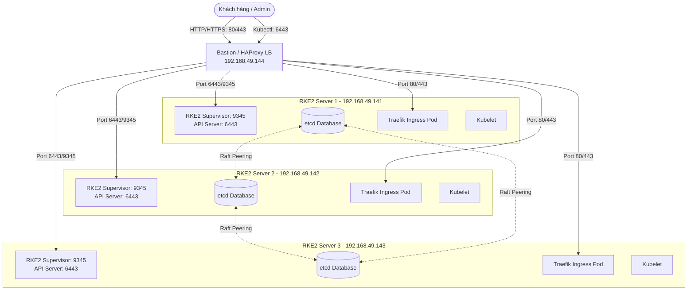

# Kiến trúc Cụm RKE2 Kubernetes High Availability

Tài liệu này mô tả chi tiết kiến trúc, các thành phần nội tại của RKE2 (phiên bản v1.36.1+rke2r2), và cơ chế định tuyến (Ingress) trong cụm 4 node hiện tại.

---

## 1. Mô hình Tổng thể (High Level Architecture)

Cụm được phân bổ làm 2 phân vùng logic chính:
- **Khu vực quản trị & cân bằng tải**: Node Bastion (`192.168.49.144`) chạy HAProxy.
- **Khu vực tính toán & dữ liệu**: 3 node Server (`141`, `142`, `143`) chạy tích hợp cả **Control Plane**, **etcd**, và **Worker (Agent)**.



---

## 2. Các Thành phần chi tiết trong Cụm RKE2

RKE2 (Rancher Kubernetes Engine v2) là phiên bản Kubernetes bảo mật cao, được thiết kế đóng gói sẵn (single binary) nhưng chạy các thành phần dưới dạng container (qua `containerd` nhúng).

### A. RKE2 Supervisor (Port 9345)
- **Vai trò**: Là một dịch vụ API nội bộ của Rancher.
- **Nhiệm vụ**: 
  - Cho phép các node mới đăng ký (join) vào cụm một cách an toàn bằng token.
  - Phân phối các chứng chỉ SSL/TLS ban đầu cho các node mới.
  - Đồng bộ hóa cấu hình bootstrap của cụm etcd giữa các Server node.

### B. Control Plane (Bộ não điều khiển)
Nằm trên cả 3 node server, chạy ở chế độ Active-Active thông qua cân bằng tải của HAProxy:
1. **kube-apiserver (Port 6443)**: Điểm tiếp nhận mọi yêu cầu điều phối của Kubernetes (từ kubectl, các pod, controllers).
2. **kube-scheduler**: Lập lịch đưa pod vào chạy trên node phù hợp.
3. **kube-controller-manager**: Giám sát trạng thái cụm (ví dụ: tự động tạo lại pod khi có pod bị lỗi).
4. **cloud-controller-manager**: Tương tác với hạ tầng đám mây (nếu có).

### C. Cơ sở dữ liệu etcd (Database lưu trữ trạng thái)
- **Vai trò**: Cơ sở dữ liệu dạng Key-Value phân tán, lưu trữ toàn bộ cấu hình và trạng thái của Kubernetes.
- **Cơ chế hoạt động**: Sử dụng thuật toán đồng thuận **Raft**. 
- **Đặc tính HA**: Cần số lượng node lẻ (ở đây là 3 node) để đảm bảo tính đồng thuận (**Quorum = (N/2) + 1 = (3/2)+1 = 2**). Nếu 1 node bất kỳ gặp sự cố, 2 node còn lại vẫn đủ số lượng quorum để ghi dữ liệu, hệ thống hoạt động bình thường. Nếu mất 2 node, cụm sẽ rơi vào trạng thái Read-Only để bảo vệ dữ liệu.

### D. Agent / Worker (Nơi chạy ứng dụng)
Vì 3 node này kiêm cả vai trò Worker nên chúng sẽ chạy:
1. **Kubelet**: Agent trực tiếp điều khiển container engine (`containerd`) để chạy các Pod theo lệnh từ API Server.
2. **Kube-Proxy**: Cấu hình iptables/ipvs trên máy chủ để định tuyến mạng dịch vụ (ClusterIP, NodePort) đến đúng Pod.
3. **CNI Canal (Calico + Flannel)**: Cung cấp mạng nội bộ cho các Pod (Pod IP) và thực thi các chính sách bảo mật mạng (Network Policies).

---

## 3. Kiến trúc Ingress: Traefik vs NGINX Ingress

### A. Ingress Controller là gì?
Ingress Controller đóng vai trò như một Reverse Proxy nằm ở rìa (edge) của cụm Kubernetes. Nó tiếp nhận các traffic từ bên ngoài đi vào (thường là HTTP/HTTPS qua port 80/443) và chuyển hướng tới các Service/Pod tương ứng dựa trên cấu hình Domain hoặc Path (Ingress Resource).

### B. Thay đổi quan trọng ở phiên bản RKE2 v1.36+
- **Trước v1.36**: RKE2 mặc định đi kèm **NGINX Ingress Controller** (được build bởi cộng đồng Kubernetes).
- **Từ v1.36 trở đi**: RKE2 đã chính thức chuyển sang sử dụng **Traefik làm Ingress Controller mặc định**, thay thế hoàn toàn cho NGINX Ingress (đã bị khai tử hoặc chuyển sang chế độ bảo trì ở upstream của Rancher).
- **So sánh Traefik vs NGINX**:
  - **Traefik**: Cực kỳ nhẹ, tự động phát hiện service (Dynamic Routing) rất tốt, hỗ trợ HTTP/3, tích hợp sẵn Let's Encrypt tự động cấp SSL, có giao diện Dashboard trực quan.
  - **NGINX**: Cấu hình tĩnh qua ConfigMap, tiêu tốn nhiều tài nguyên hơn khi số lượng Ingress tăng lên.

### C. Có nên cài đặt chung cả hai không?
> [!WARNING]
> **KHÔNG NÊN** cài đặt chung cả Traefik và NGINX Ingress trong cụm này.

**Lý do:**
1. **Xung đột Port trên Host**: Cả hai Ingress Controller mặc định đều muốn liên kết (bind) vào cổng `80` và `443` của máy chủ (dưới dạng DaemonSet HostPort hoặc qua LoadBalancer Service). Nếu chạy chung, chúng sẽ tranh chấp cổng này dẫn đến lỗi khởi động.
2. **Lãng phí tài nguyên RAM**: Máy chủ của bạn chỉ có **6GB RAM**. Mỗi Ingress Controller chạy tốn từ 200MB - 500MB RAM. Việc chạy cả hai sẽ làm giảm tài nguyên khả dụng cho các ứng dụng thực tế.
3. **Phức tạp hóa cấu hình**: Bạn phải định nghĩa `ingressClassName: nginx` hoặc `ingressClassName: traefik` cho từng ứng dụng, tăng khả năng cấu hình sai.

**Giải pháp đề xuất:** Sử dụng duy nhất **Traefik** (được cấu hình mặc định sẵn trong phiên bản v1.36).

---

## 4. Đường đi của một Request (Network Traffic Flow)

Khi một người dùng truy cập trang web chạy trên cụm (ví dụ: `https://app.lakehouse.com`):
Nhớ phải add host : `C:\Windows\System32\drivers\etc\hosts`

```
192.168.49.144  longhorn.lakehouse.local
192.168.49.144  app1.lakehouse.local
192.168.49.144  app2.lakehouse.local
```

```text
[Khách hàng]
     │
     ▼ (Truy cập https://app.lakehouse.com - Port 443)
[Bastion Node: HAProxy Load Balancer (192.168.49.144)]
     │
     ├─► Chuyển tiếp TCP đến Port 443 của RKE2 Node 141
     ├─► Hoặc RKE2 Node 142
     └─► Hoặc RKE2 Node 143
     │
     ▼ (Đi qua cổng HostPort 443 của Node)
[Traefik Ingress Pod]
     │ (Phân tích domain "app.lakehouse.com", giải mã SSL/TLS nếu cấu hình)
     ▼ (Chuyển tiếp đến Cluster IP của Service)
[Kubernetes Service (app-service)]
     │ (Cân bằng tải nội bộ qua Kube-Proxy)
     ▼
[App Pod] (Ứng dụng chạy thực tế trên container)
```

---

## 5. Tùy biến cấu hình Traefik trong RKE2

Mặc định RKE2 v1.36 sẽ tự động deploy Traefik. Nếu bạn muốn cấu hình thêm (ví dụ: kích hoạt Dashboard, chỉnh sửa cấu hình log,...), bạn có thể tạo một file cấu hình Helm tại thư mục manifests của Server đầu tiên:

`[NEW] /var/lib/rancher/rke2/server/manifests/rke2-traefik-config.yaml`
```yaml
apiVersion: helm.cattle.io/v1
kind: HelmChartConfig
metadata:
  name: rke2-traefik
  namespace: kube-system
spec:
  valuesContent: |-
    # Kích hoạt Traefik Dashboard (mặc định tắt)
    ingressRoute:
      dashboard:
        enabled: true
    # Cấu hình log mức độ cảnh báo
    logs:
      general:
        level: WARN
```
RKE2 sẽ tự động theo dõi thư mục này và áp dụng cấu hình đè lên biểu đồ Helm mặc định mà không cần bạn can thiệp thủ công.
