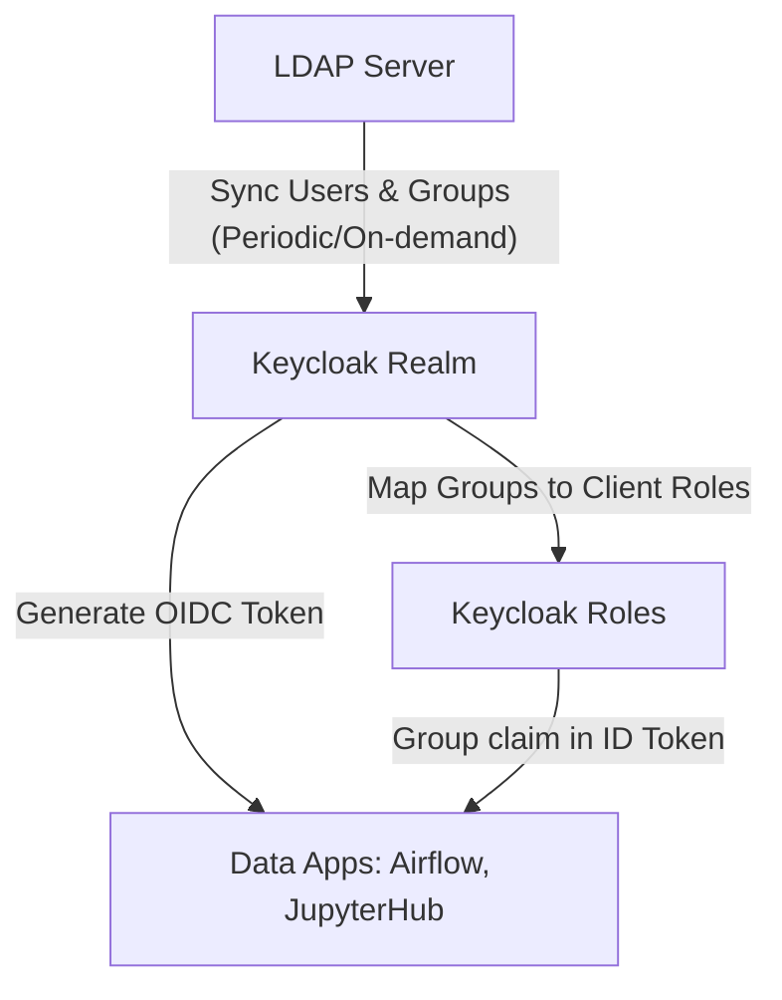

# Tài liệu Thiết kế Keycloak cho cụm RKE2 Lakehouse

Tài liệu này mô tả vai trò, kiến trúc định danh, mô hình phân quyền và cách tích hợp Single Sign-On (SSO) + LDAP bằng **Keycloak** trên cụm **RKE2 HA** hiện tại cho các ứng dụng dữ liệu (Airflow, JupyterHub, v.v.).

---

## 1. Mục tiêu thiết kế

Trong hệ sinh thái Lakehouse, các công cụ xử lý dữ liệu, trực quan hóa và quản trị (Airflow, JupyterHub, Kafka UI, MinIO Console, Trino, Superset, v.v.) yêu cầu cơ chế xác thực và phân quyền nhất quán. Thay vì quản lý tài khoản riêng lẻ trên từng ứng dụng (identity silos), hệ thống sử dụng Keycloak làm IAM (Identity and Access Management) trung tâm.

Mục tiêu chính:
*   **Single Sign-On (SSO):** Người dùng chỉ cần đăng nhập một lần thông qua giao thức OpenID Connect (OIDC) hoặc SAML 2.0 để truy cập mọi công cụ.
*   **LDAP User Federation:** Keycloak đóng vai trò là "Identity Broker", kết nối tới máy chủ LDAP/Active Directory nội bộ để xác thực tài khoản và đồng bộ nhóm (Groups).
*   **GitOps/ArgoCD Managed:** Toàn bộ thành phần (Keycloak Helm Chart + PostgreSQL DB) được quản lý qua GitOps. Không sử dụng các thao tác thủ công ngoài ý muốn.
*   **Khả năng chạy offline:** Sử dụng Helm chart community `keycloakx` v7.2.0 (Keycloak v26.6.2 Quarkus-based) được vendor trực tiếp vào repo Git, sẵn sàng chạy trong môi trường Air-gapped.
*   **High Availability (HA):** Keycloak chạy 2 bản sao (replicas), phân chia qua các server node RKE2 khác nhau, sử dụng Infinispan distributed cache để đồng bộ session.

---

## 2. Kiến trúc tổng thể và luồng dữ liệu

### 2.1. Sơ đồ Luồng HTTPS và Xác thực (Authentication Flow)

```text
User Browser
   |
   | (1) Truy cập airflow.lakehouse.local
   v
Bastion HAProxy (192.168.49.144)
   |
   | (2) TCP Passthrough (Port 443)
   v
RKE2 Node Server (141/142/143)
   |
   | (3) Traefik Ingress Controller (Terminate TLS bằng keycloak-tls)
   v
Airflow Pod (Nhận thấy chưa có Session)
   |
   | (4) Redirect sang keycloak.lakehouse.local/auth
   v
User Browser (Đăng nhập tại Keycloak Login Page)
   |
   | (5) Nhập Username/Password
   v
Keycloak Pod
   |
   | (6) Xác thực chéo (LDAP Bind/Verify)
   v
LDAP Server (Directory Service)
   |
   | (7) Kết quả xác thực + Thông tin Group/User
   v
Keycloak Pod (Tạo OIDC ID/Access Token chứa Group/Role claims)
   |
   | (8) Redirect kèm Authorization Code về Airflow
   v
Airflow Pod (Verify token với Keycloak và cấp quyền truy cập dựa trên Group)
```

### 2.2. Vị trí của Keycloak và Database trong K8s Namespace

Tất cả các tài nguyên của Keycloak được triển khai gọn trong namespace `keycloak` để dễ quản lý và phân tách quyền hạn (NetworkPolicies).

```text
Namespace: keycloak
 ├── Ingress (keycloak.lakehouse.local)
 ├── Service (keycloak-headless, keycloak)
 ├── StatefulSet: keycloak (2 Replicas, Quarkus Engine)
 └── StatefulSet: keycloak-db (1 Replica, Postgres 16, Longhorn PV/PVC)
```

*   **Keycloak Engine:** Dựa trên Quarkus, giúp giảm thời gian khởi động và lượng RAM tiêu thụ đáng kể so với bản legacy Wildfly.
*   **StatefulSet Database:** Keycloak là stateful application cần database quan hệ để lưu dữ liệu config (Realms, Clients, Roles, Users local). Ta deploy PostgreSQL 16 chạy local trong namespace, mount data vào ổ đĩa phân tán Longhorn (Storage Class: `longhorn`).

---

## 3. Tích hợp User Federation (LDAP) và Role Mapping

Keycloak đóng vai trò là cầu nối giữa dịch vụ thư mục (LDAP/Active Directory) và các Web App thông qua cơ chế User Federation.



### 3.1. Cấu hình User Federation trong Keycloak
*   **Connection URL:** `ldap://ldap-server.lakehouse.local:389` hoặc `ldaps://...:636`
*   **Read-Only Mode:** Keycloak chỉ đọc thông tin định danh và group từ LDAP, việc quản lý user/mật khẩu vẫn do LDAP Controller đảm nhận (khuyên dùng cho bảo mật).
*   **Sync Settings:**
    *   *Full Sync:* Chạy định kỳ (ví dụ mỗi 24 giờ) để cập nhật toàn bộ database người dùng.
    *   *Changed Users Sync:* Chạy thường xuyên hơn (ví dụ mỗi 10-15 phút) để cập nhật những thay đổi mới nhất.
*   **User/Group Mappers:** Thiết lập các mapper để chuyển đổi thuộc tính LDAP (ví dụ: `mail`, `cn`, `memberOf`) thành thuộc tính của User Keycloak.

### 3.2. Mẫu Phân quyền (Role/Group Mapping)

Hệ thống sẽ ánh xạ các LDAP groups thành các roles tương ứng trong Keycloak:

| LDAP Group | Keycloak Role | Airflow Role | JupyterHub Role |
| :--- | :--- | :--- | :--- |
| `cn=data_admin,ou=groups,dc=lakehouse,dc=local` | `admin` | `Admin` | `admin` (super-user) |
| `cn=data_engineer,ou=groups,dc=lakehouse,dc=local` | `developer` | `Op` / `User` | `user` (default) |
| `cn=data_analyst,ou=groups,dc=lakehouse,dc=local` | `analyst` | `Viewer` | `user` (default) |

---

## 4. Thiết kế Tích hợp SSO cho các Ứng dụng Dữ liệu

### 4.1. Apache Airflow (OIDC Integration)
Airflow sử dụng thư viện Flask-AppBuilder (FAB) để quản lý bảo mật. Ta sẽ tích hợp OIDC của Keycloak vào `webserver_config.py` của Airflow:

1.  **Tạo OIDC Client trong Keycloak:**
    *   Client ID: `airflow`
    *   Client Protocol: `openid-connect`
    *   Access Type: `confidential` (cần Client Secret)
    *   Valid Redirect URIs: `https://airflow.lakehouse.local/oauth-authorized/keycloak`
2.  **Cấu hình Mappers:** Đảm bảo trường `roles` hoặc `groups` được thêm vào ID Token để Airflow có thể parse và map sang FAB Roles (`Admin`, `Op`, `User`, `Viewer`).

### 4.2. JupyterHub (OAuthenticator)
JupyterHub hỗ trợ xác thực OAuth2/OIDC qua package `oauthenticator`. Cấu hình trong `jupyterhub_config.py`:

1.  **Tạo OIDC Client trong Keycloak:**
    *   Client ID: `jupyterhub`
    *   Access Type: `confidential` (hoặc `public` tùy kiến trúc mạng)
    *   Valid Redirect URIs: `https://jupyterhub.lakehouse.local/hub/oauth_callback`
2.  **Cơ chế Phân quyền:**
    *   Sử dụng `GenericOAuthenticator`.
    *   Đọc thông tin username từ claim `preferred_username`.
    *   Ánh xạ quyền Admin trong JupyterHub (`admin_users`) dựa trên group claims từ Keycloak token.

---

## 5. Production Baseline và Vận hành GitOps

*   **JVM Memory Tuning:** Keycloak chạy trên Java Virtual Machine (JVM). Ta cấu hình resource limits cho Keycloak Pod là `1500m CPU` và `2048Mi RAM` để đảm bảo heap memory (`-Xms512m -Xmx1024m` được tự động tối ưu qua biến Quarkus) hoạt động mượt mà.
*   **Database Check:** Keycloak StatefulSet cấu hình `initContainers.dbchecker` sử dụng `busybox` để ping TCP port `5432` của `keycloak-db` trước khi khởi động. Điều này giúp loại bỏ tình trạng Keycloak CrashLoopBackOff khi database chưa sẵn sàng.
*   **TLS termination at Ingress:** Traefik terminate TLS dùng SSL Certificate được quản lý tự động bởi cert-manager thông qua ClusterIssuer `lakehouse-ca`. Connection từ Traefik Ingress tới Keycloak Service chạy qua HTTP (Port 8080) để tăng hiệu năng, nhưng Keycloak được cấu hình `proxy: forwarded` và `KC_PROXY_HEADERS: forwarded` để nó hiểu rằng request gốc là HTTPS và sinh URL redirect chính xác.
*   **Distributed Cache (Infinispan):** Bằng việc sử dụng chart `codecentric/keycloakx` với cấu hình default `cache.stack: default`, Keycloak tự động bật chế độ clustering sử dụng `jdbc-ping` hoặc `dns-ping` để phát hiện các Pod Keycloak lân cận, đồng bộ trạng thái session đăng nhập của người dùng qua mạng.

---

## 6. Tự động khởi tạo cấu hình (Realm Auto-Import)

Để hiện thực hóa triết lý GitOps hoàn chỉnh và loại bỏ các thao tác cấu hình thủ công trên UI (clickops) dễ gây sai sót khi khởi tạo lại cụm, hệ thống áp dụng cơ chế **Realm Auto-Import**:

1.  **Định nghĩa Realm Config:** Toàn bộ thông tin cấu hình của Realm `lakehouse`, bao gồm các OIDC Client cho `airflow` và `jupyterhub` (với các Client Secrets cố định), cùng danh sách các role mặc định cho phòng dữ liệu (`Admin`, `PM`, `DE`, `DA`, `BA`, `DS`) được khai báo dưới dạng JSON trong file `manifests/realm-import.yaml`.
2.  **Mount ConfigMap vào Container:** ConfigMap này được ánh xạ vào thư mục `/opt/keycloak/data/import/` bên trong Keycloak container.
3.  **Tham số Khởi động:** Keycloak StatefulSet chạy lệnh khởi động kèm cờ `--import-realm`. Khi khởi động lần đầu tiên (hoặc khi cơ sở dữ liệu trống), Quarkus-based Keycloak sẽ quét thư mục trên, tự động import toàn bộ cấu hình Realm, Clients và Roles vào cơ sở dữ liệu.
4.  **Bảo vệ Dữ liệu:** Nếu Realm đã tồn tại trong database (ví dụ Pod restart), Keycloak sẽ tự động bỏ qua quá trình import để tránh ghi đè lên các thay đổi runtime mà quản trị viên đã cập nhật trực tiếp trên UI. Điều này đảm bảo tính bền vững của dữ liệu nhưng vẫn cung cấp khả năng bootstrap tự động 100% khi tái dựng cụm.

---

## 7. Lộ trình nâng cấp lên PostgreSQL HA và Quy trình Migration

### 7.1. Định hướng Production PostgreSQL HA
Trong môi trường production thực tế, việc sử dụng PostgreSQL chạy đơn lẻ (Single Pod) như cấu hình mặc định hiện tại là một điểm nghẽn (Single Point of Failure). Khuyến nghị nâng cấp lên một cụm PostgreSQL High Availability (HA):

1.  **Sử dụng Kubernetes Operator (Khuyên dùng):**
    *   **CloudNativePG (CNPG):** Đây là PostgreSQL Operator hiện đại và tối ưu nhất cho Kubernetes hiện nay. Nó tự động quản lý replica (Primary/Standby), tự động failover cực nhanh, tích hợp sẵn backup sang MinIO/S3 (Barman) và hỗ trợ rolling update không downtime.
    *   **Zalando Postgres Operator:** Giải pháp phổ biến khác sử dụng Patroni để clustering.
2.  **Sử dụng Cụm Database ngoài cụm K8s (External HA):**
    *   Trỏ Keycloak tới cụm PostgreSQL HA chạy trên các máy ảo (VMs) chuyên dụng được quản lý độc lập (sử dụng Pacemaker/Corosync hoặc Patroni + HAProxy).

### 7.2. Nguyên lý Migration sang cụm HA
Quá trình chuyển đổi từ database đơn lẻ hiện tại sang cụm HA rất đơn giản vì Keycloak hoàn toàn stateless và lưu trữ toàn bộ trạng thái trong DB:

1.  **Sao lưu dữ liệu cũ:** Trích xuất schema và dữ liệu hiện tại bằng công cụ `pg_dump`.
2.  **Khởi tạo Database HA mới:** Dựng cụm database HA, tạo database `keycloak` và cấp quyền đầy đủ cho user.
3.  **Khôi phục dữ liệu:** Import tệp SQL đã backup vào cụm HA mới.
4.  **Cập nhật cấu hình GitOps (Zero-Downtime):** Sửa thông số `database.hostname` và credentials trong Git trỏ về Service của DB HA mới (ví dụ: `keycloak-db-ha-rw.database.svc.cluster.local`). ArgoCD sẽ thực hiện rolling update Pods Keycloak. Các Pod mới sẽ kết nối tới DB HA và hoạt động ngay lập tức mà không mất bất kỳ cấu hình hay session nào.


