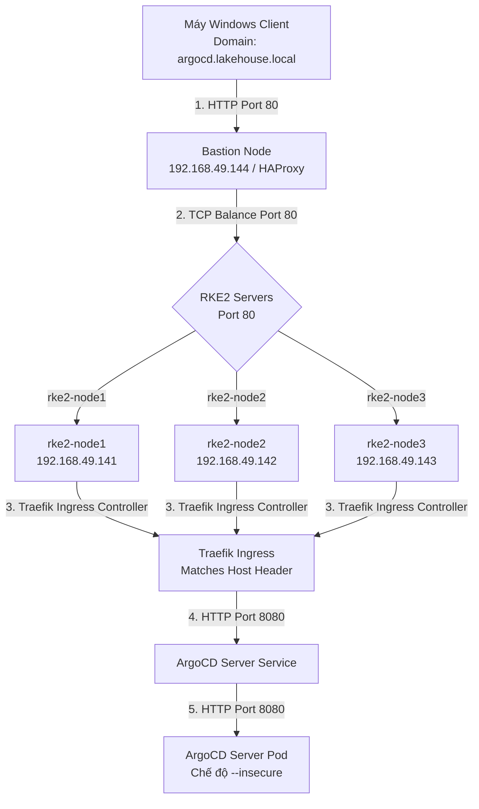

# Tài liệu Thiết kế & Triển khai ArgoCD trên cụm RKE2 HA

Tài liệu này mô tả chi tiết kiến trúc, luồng đi của mạng (Network Traffic Flow), thiết kế cấu hình và hướng dẫn triển khai **ArgoCD** lên cụm RKE2 HA bằng **Terraform**.

---

## 1. Tại sao lựa chọn Terraform để triển khai ArgoCD?

Thay vì sử dụng các câu lệnh `kubectl apply` thủ công hoặc cài đặt trực tiếp bằng Helm từ dòng lệnh, việc sử dụng **Terraform** mang lại những lợi ích vượt trội:
*   **Cơ sở hạ tầng dạng Code (Infrastructure as Code - IaC):** Toàn bộ cấu hình ArgoCD (namespace, phiên bản chart, cấu hình Ingress, các tham số tùy chỉnh) được định nghĩa rõ ràng trong file code và lưu trữ trong Git.
*   **Quản lý Trạng thái (State Management):** Terraform theo dõi trạng thái của các tài nguyên được tạo ra. Khi cần cập nhật cấu hình hoặc nâng cấp phiên bản ArgoCD, ta chỉ cần thay đổi mã nguồn và chạy `terraform apply`. Hệ thống sẽ tự tính toán phần thay đổi để cập nhật tối ưu nhất.
*   **Dễ dàng gỡ bỏ (Clean Cleanup):** Khi muốn làm sạch cụm hoặc cài đặt lại, lệnh `terraform destroy` sẽ tự động xóa sạch toàn bộ các tài nguyên liên quan một cách an toàn và triệt để.
*   **Bắt đầu chu trình GitOps (GitOps Bootstrapping):** Sử dụng Terraform để dựng lên "bộ máy kéo" ArgoCD. Sau đó, ArgoCD sẽ đảm nhận nhiệm vụ tự động đồng bộ (GitOps) tất cả các ứng dụng khác như Rancher, Longhorn, cert-manager, v.v.

---

## 2. Kiến trúc & Luồng đi của Traffic (Network Traffic Flow)

Do cụm RKE2 được dựng dưới dạng High Availability (HA) và sử dụng **Traefik** làm Ingress Controller mặc định, luồng đi của request từ máy tính Windows của bạn đến giao diện ArgoCD UI được thiết kế như sau:



### Chi tiết luồng xử lý:
1.  **Phân giải Tên miền:** Client truy cập `http://argocd.lakehouse.local`. Máy Windows sử dụng file `hosts` để phân giải tên miền này về IP của **Bastion Node** (`192.168.49.144`).
2.  **Cân bằng tải HAProxy:** HAProxy trên Bastion nhận request ở cổng `80`, thực hiện cân bằng tải TCP ở tầng L4 và chuyển tiếp request tới cổng `80` của một trong ba node RKE2 Server (`192.168.49.141`, `192.168.49.142`, `192.168.49.143`).
3.  **Điều hướng Traefik Ingress:** Trên các node RKE2, **Traefik** đang lắng nghe ở cổng `80` host. Nó đọc `Host Header` (`argocd.lakehouse.local`), đối chiếu với cấu hình Kubernetes Ingress của ArgoCD và chuyển tiếp traffic tới Service của ArgoCD.
4.  **Chế độ Insecure (SSL Termination):** Traefik đóng vai trò xử lý/kết thúc các kết nối từ ngoài vào. Bên trong cụm, nó gọi ArgoCD Server Service bằng giao thức HTTP thông thường (cổng `8080`). Để tránh lỗi lặp vòng chuyển hướng (`ERR_TOO_MANY_REDIRECTS`) do ArgoCD mặc định tự chuyển sang HTTPS, chúng ta cấu hình ArgoCD Server khởi chạy với cờ `--insecure`.

---

## 3. Cấu trúc Thư mục Terraform

Thư mục chứa mã nguồn triển khai nằm tại: `d:/workspace_thinh1/lakehouse/rke2/terraform_argocd/`
*   [variables.tf](file:///d:/workspace_thinh1/lakehouse/rke2/terraform_argocd/variables.tf): Khai báo các biến tùy chỉnh (Kubeconfig path, Chart version, Domain).
*   [main.tf](file:///d:/workspace_thinh1/lakehouse/rke2/terraform_argocd/main.tf): Cấu hình Kubernetes + Helm Providers, khởi tạo Namespace `argocd`, và deploy Helm chart ArgoCD đi kèm cấu hình Ingress Traefik.
*   [outputs.tf](file:///d:/workspace_thinh1/lakehouse/rke2/terraform_argocd/outputs.tf): Xuất ra URL truy cập và câu lệnh mẫu để lấy mật khẩu admin khởi tạo.

---

## 4. Hướng dẫn Triển khai Từng bước (Deployment Steps)

Bạn sẽ thực hiện cài đặt Terraform trên máy Bastion và chạy mã nguồn từ đó.

### Bước 1: Đồng bộ thư mục Terraform lên máy Bastion
Từ máy Windows của bạn (hoặc thông qua Git/SCP), sao chép thư mục `rke2` lên thư mục home của user `thinh1` trên Bastion:
```bash
# Chạy lệnh SCP từ máy Windows
scp -r d:\workspace_thinh1\lakehouse\rke2 thinh1@192.168.49.144:~/
```

### Bước 2: Cài đặt Terraform trên Bastion Node (nếu chưa có)
SSH vào Bastion Node (`192.168.49.144`) bằng user `thinh1` / mật khẩu `123123123`. Chạy các lệnh sau để cài đặt Terraform từ repo chính thức của HashiCorp:
```bash
sudo apt-get update && sudo apt-get install -y gnupg software-properties-common

wget -O- https://apt.releases.hashicorp.com/gpg | gpg --dearmor | sudo tee /usr/share/keyrings/hashicorp-archive-keyring.gpg > /dev/null

gpg --no-default-keyring --keyring /usr/share/keyrings/hashicorp-archive-keyring.gpg --fingerprint

echo "deb [signed-by=/usr/share/keyrings/hashicorp-archive-keyring.gpg] https://apt.releases.hashicorp.com/ $(lsb_release -cs) main" | sudo tee /etc/apt/sources.list.d/hashicorp.list

sudo apt-get update && sudo apt-get install -y terraform
```
Kiểm tra cài đặt thành công:
```bash
terraform -version
```

### Bước 3: Khởi tạo và Apply Terraform
Di chuyển tới thư mục chứa code Terraform trên Bastion và thực hiện các bước sau:
```bash
cd ~/rke2/terraform_argocd

# 1. Khởi tạo providers (Kubernetes & Helm)
terraform init

# 2. Kiểm tra trước các tài nguyên sẽ được tạo
terraform plan

# 3. Tiến hành triển khai lên cụm RKE2
terraform apply
```
*Gõ `yes` khi được xác nhận.* Hệ thống sẽ tự động tạo namespace `argocd`, tải và cài đặt ArgoCD Helm Chart phiên bản `9.5.17` (tương ứng với ArgoCD v3.4.x - phiên bản mới nhất hoàn toàn phù hợp với Kubernetes v1.36 trên RKE2), đồng thời tạo Ingress định hướng qua Traefik.

### Bước 4: Lấy mật khẩu Admin khởi tạo của ArgoCD
Sau khi `terraform apply` hoàn thành xuất sắc, chạy lệnh sau để lấy mật khẩu đăng nhập lần đầu tiên:
```bash
kubectl -n argocd get secret argocd-initial-admin-secret -o jsonpath='{.data.password}' | base64 -d && echo
```
Hãy lưu lại chuỗi ký tự mật khẩu này.

### Bước 5: Cấu hình phân giải DNS trên máy Windows
Để truy cập được domain `argocd.lakehouse.local` từ trình duyệt của máy Windows:
1.  Mở ứng dụng **Notepad** (hoặc trình soạn thảo văn bản bất kỳ) bằng quyền **Administrator** (Run as Administrator).
2.  Mở file: `C:\Windows\System32\drivers\etc\hosts`.
3.  Thêm dòng sau vào cuối file và lưu lại:
    ```text
    192.168.49.144  argocd.lakehouse.local
    ```

---

## 5. Truy cập & Kiểm tra

1.  Mở trình duyệt web trên máy Windows và truy cập địa chỉ: `http://argocd.lakehouse.local`
2.  Giao diện đăng nhập ArgoCD sẽ hiển thị trực quan và mượt mà.
3.  Nhập thông tin tài khoản:
    *   **Username:** `admin`
    *   **Password:** *(Chuỗi mật khẩu lấy được ở Bước 4)*
4.  Khi đăng nhập thành công, bạn sẽ vào giao diện quản lý Dashboard của ArgoCD. Từ đây, chúng ta đã sẵn sàng tạo các "Application" để kéo mã nguồn Kubernetes manifest từ Git về và triển khai tự động (GitOps).

---

## 6. Lộ trình tích hợp tiếp theo qua ArgoCD

Khi ArgoCD đã chạy ổn định, ta sẽ không cần dùng Terraform hay Helm thủ công cho các ứng dụng nữa. Thay vào đó, ta sẽ tạo các file định nghĩa ứng dụng (ArgoCD Application CRD) trỏ tới git repo để quản lý:
1.  **Cert Manager:** Để tự động cấp phát chứng chỉ SSL/TLS miễn phí từ Let's Encrypt hoặc CA nội bộ.
2.  **Rancher Manager:** Để giám sát, quản lý giao diện đồ họa trực quan của toàn bộ cụm RKE2.
3.  **Longhorn:** Hệ thống lưu trữ phân tán (Distributed Block Storage) phục vụ cho các StatefulSets ứng dụng (Database, Persistent Volumes).

---

## 7. Hướng dẫn Gỡ cài đặt (Uninstall)

Nhờ có Terraform theo dõi và quản trị State của các tài nguyên, việc gỡ bỏ ArgoCD diễn ra cực kỳ nhanh chóng và an toàn. Bạn chỉ cần di chuyển vào thư mục code và chạy lệnh:
```bash
terraform destroy
```
*Gõ `yes` khi được yêu cầu.* Terraform sẽ tự động gỡ bỏ Helm Release `argo-cd` và xóa namespace `argocd`, dọn sạch sẽ toàn bộ tài nguyên trên cụm RKE2 của bạn.

---

## 8. Tối ưu hóa Tài nguyên & Cấu hình HA (High Availability)

### 8.1. Cấu hình Tài nguyên mặc định (Resource Limits & Requests)
Mã nguồn Terraform đã cấu hình sẵn mức giới hạn tài nguyên an toàn cho từng Service của ArgoCD để tránh tình trạng rò rỉ bộ nhớ (memory leaks) làm treo node:
*   **Controller:** Request `256Mi RAM / 250m CPU` -> Limit `512Mi RAM / 500m CPU`.
*   **Repo Server:** Request `256Mi RAM / 250m CPU` -> Limit `1024Mi RAM / 1000m CPU`.
*   **Server:** Request `128Mi RAM / 125m CPU` -> Limit `512Mi RAM / 500m CPU`.
*   **Dex & Notifications:** Request `128Mi RAM / 100m CPU` -> Limit `256Mi RAM / 200m CPU`.

### 8.2. Cấu hình High Availability (HA)
Mặc định, hệ thống đang cài đặt ở chế độ **tối thiểu (Non-HA - 1 replica)** nhằm tiết kiệm RAM tối đa cho các node ảo hóa (mỗi node chỉ có 6GB RAM). 

Nếu muốn nâng cấp lên mô hình sản xuất **High Availability (HA)** để phân phối tải đều ra 3 node RKE2 Server (Active-Active), bạn chỉ cần sửa các biến cấu hình trong [variables.tf](file:///d:/workspace_thinh1/lakehouse/rke2/terraform_argocd/variables.tf) hoặc truyền trực tiếp qua CLI khi apply:

#### Cách cấu hình trong `variables.tf`:
```hcl
variable "argocd_ha_enabled" {
  default = true # Đổi từ false thành true để bật Redis-HA
}

variable "argocd_server_replicas" {
  default = 2 # Nâng số lượng pod Server lên 2
}

variable "argocd_repo_server_replicas" {
  default = 2 # Nâng số lượng pod Repo Server lên 2
}
```

#### Cách chạy trực tiếp qua CLI:
```bash
terraform apply \
  -var="argocd_ha_enabled=true" \
  -var="argocd_server_replicas=2" \
  -var="argocd_repo_server_replicas=2"
```

### Xóa pod cưỡng bức trong trường hợp controller-0 chết node
``` kubectl delete pod argo-cd-argocd-application-controller-0 -n argocd --force --grace-period=0 ```


> [!IMPORTANT]
> **Lưu ý về tài nguyên khi chạy HA:**
> Khi bật `argocd_ha_enabled = true`, Terraform sẽ kích hoạt cụm **Redis-HA** sử dụng Sentinel (sẽ tạo ra 3 Pod Redis và 3 Pod Sentinel). Nhờ cơ chế `Pod Anti-Affinity` (luật chống chạy chung node), các Pod Redis này sẽ được phân tán đều trên 3 Server của cụm. 
> Bạn cần đảm bảo cụm RKE2 có tối thiểu 3 node Server hoạt động bình thường để lên lịch chạy thành công cho các Pod này.

